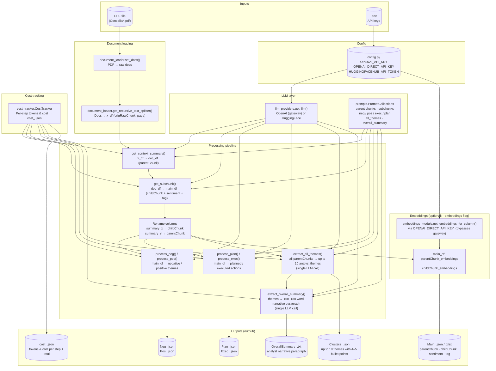

# Pipeline workflow and file map

High-level flowchart of building blocks and data flow.

## File roles

| File | Role |
|------|------|
| **config.py** | Loads `.env`; exposes `OPENAI_API_KEY`, `OPENAI_DIRECT_API_KEY` (for embeddings), `HUGGINGFACEHUB_API_TOKEN`, default model names. |
| **llm_providers.py** | `get_llm(provider, model_name)` → OpenAI or HuggingFace adapter; same interface for all chains. |
| **cost_tracker.py** | `CostTracker`: records each LLM call (tokens, cost) keyed by step name; `get_summary_for_output()` writes per-step and total to `cost_<name>.json`. |
| **prompts.py** | `PromptCollections`: all prompt strings — parent chunks, subchunks, neg/pos/executed/planned themes, `get_all_themes` (up to 10 analyst themes), `get_overall_summary` (narrative paragraph). |
| **document_loader.py** | `set_docs()`, `get_recursive_text_splitter()`: load PDF/folder/URL and chunk into `x_df`. |
| **process_concall.py** | `ProcessConcall`: context summary → subchunks → neg/pos/exec/plan themes → `extract_all_themes` (prompt-based, single LLM call) → `extract_overall_summary`. Uses LLM adapter + cost tracker throughout. |
| **embeddings_module.py** | `get_embeddings_for_column(df, col, model_type, model_name)`: adds `{col}_embeddings` column. Uses `OPENAI_DIRECT_API_KEY` to bypass the gateway for embedding calls. |
| **run_pipeline.py** | Entrypoint: PDF → full pipeline → theme extraction → overall summary → (optional) embeddings → save all outputs and cost JSON. |

## Data flow (simplified)

1. **PDF** → `set_docs` → **documents** → `get_recursive_text_splitter` → **x_df** (origRawChunk, page).
2. **x_df** → `get_context_summary` (LLM, parallel) → **doc_df** (+ parentChunk).
3. **doc_df** → `get_subchunk` (LLM, parallel) → **main_df** (childChunk, positive, negative, neutral, tag, keywords, parentChunk).
4. **main_df** → `process_neg` / `process_pos` → **Neg_\*.json** / **Pos_\*.json**.
5. **main_df** → `process_plan` / `process_exec` → **Plan_\*.json** / **Exec_\*.json**.
6. **main_df** (all unique parentChunks) → `extract_all_themes` (single LLM call) → **Clusters_\*.json** (up to 10 themes, 4–5 bullet points each).
7. **themes** → `extract_overall_summary` (single LLM call) → **OverallSummary_\*.txt** (150–180 word analyst narrative).
8. *(Optional, `--embeddings`)* **main_df** → `get_embeddings_for_column` (parentChunk, childChunk) → **Main_\*.json** with embedding vectors.
9. All outputs + **cost_\*.json** saved to `output/`.
