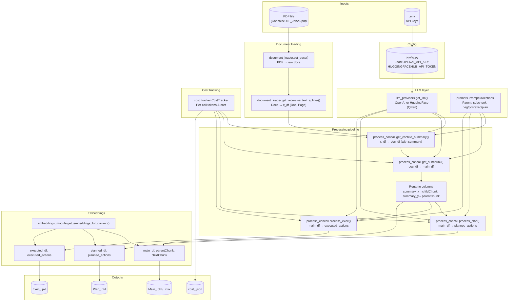

# Pipeline workflow and file map

High-level flowchart of building blocks and data flow.

## File roles

| File | Role |
|------|------|
| **config.py** | Loads `.env`; exposes `OPENAI_API_KEY`, `HUGGINGFACEHUB_API_TOKEN`, default model names. |
| **llm_providers.py** | `get_llm(provider, model_name)` → OpenAI or HuggingFace adapter; same interface for chains. |
| **cost_tracker.py** | `CostTracker`: records each LLM call (tokens, cost), summary by step, JSON output. |
| **prompts.py** | `PromptCollections`: all prompt strings (parent chunks, subchunks, neg/pos/executed/planned themes). |
| **document_loader.py** | `set_docs()`, `get_recursive_text_splitter()`: load PDF/folder/URL and chunk. |
| **process_concall.py** | `ProcessConcall`: context summary → subchunks → theme extraction; uses LLM adapter + cost tracker. |
| **embeddings_module.py** | `get_embeddings_for_column(df, column, model_type, model_name)`: add embedding column. |
| **run_pipeline.py** | Entrypoint: PDF → pipeline → embeddings for main/planned/executed → save outputs and cost. |

## Data flow (simplified)

1. **PDF** → `set_docs` → **documents** → `get_recursive_text_splitter` → **x_df** (Doc, Page).
2. **x_df** → `get_context_summary` (with LLM) → **doc_df** (Doc, Page, summary).
3. **doc_df** → `get_subchunk` (with LLM) → **main_df** (summary_x, summary_y, positive, negative, tag, …).
4. Rename → **main_df** (childChunk, parentChunk, …).
5. **main_df** → `process_plan` / `process_exec` → **planned_actions** / **executed_actions**.
6. **main_df**, **planned_df**, **executed_df** → `get_embeddings_for_column` → same DataFrames with `*_embeddings` columns.
7. Save DataFrames + cost summary to **output/**.
